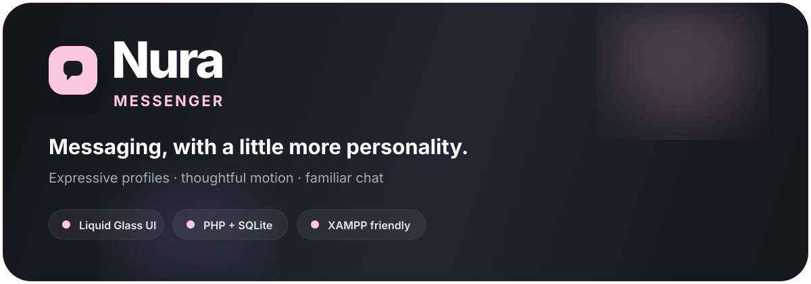

<div align="center">



# Nura Messenger

### A soft, expressive messenger built with TypeScript, PHP and SQLite.


[](../../releases)
[](#-architecture)
[](#-backend)
[](#-backend)
[](#-run-locally)
[](LICENSE)

> **Nura is an experimental, self-hostable messenger project focused on expressive conversations, beautiful profiles, soft motion, and a more human-feeling chat experience.**

</div>

---

## ✦ Why Nura?

Most messenger interfaces are optimized for utility first and personality second.
Nura keeps the familiar messaging model, then adds a warmer visual language, expressive profiles, micro-interactions, and a more editorial feel.

| Familiar | Nura's twist |
|---|---|
| 💬 Private chats | 🌸 Softer, more expressive visual language |
| 👤 Profiles | 🖼️ Custom avatar, cover, bio and social links |
| 📨 Messaging | ✨ Motion, micro-interactions and playful states |
| 📎 Attachments | 🎙️ Voice messages, images and files |
| 💗 Message actions | 📌 Pin, reply, edit, delete and copy |
| 📱 Mobile-first | 🍎 Apple-inspired hierarchy + restrained Liquid Glass |

---

## ⚡ What is inside?

### Messaging

- Direct conversations
- Reply to messages
- Edit your own messages
- Delete messages
- Pin / unpin messages
- Copy message text
- Emoji picker
- Voice-message recording
- Image attachments
- File attachments
- Read receipts
- Unread counters
- Session-based authentication

### Profiles

- Username
- Display name
- Bio
- Avatar
- Cover / banner
- Instagram
- X
- LinkedIn
- Website
- Dedicated profile editing flow
- Separate image upload handling
- Responsive profile layout


---

## 🎨 Design language

Nura uses a deliberately small palette:

```text
Primary pink    #FAC9DF
Deep background #121318
Panel           #1D1F27
Panel alt       #252833
Primary text    #F7F7F8
Muted text      #969AA8
```

The visual system follows one simple rule:

> **Glass belongs to the functional layer, not everything on screen.**

Navigation, toolbars and other interaction-heavy surfaces may use translucency and blur. Message content and primary information remain visually solid and readable.

### Motion philosophy

Motion communicates state instead of decorating every click.

Examples:

- page transitions → soft fade / slide
- message entrance → subtle spring-like movement
- buttons → compressed touch feedback
- menus → quick scale + fade
- profile media → focused editing flow
- chat updates → preserve scroll position when possible

The goal is to make Nura feel alive without making it feel noisy.

---

## 🧱 Architecture

The stable `v0.2.x` frontend is now organized as a TypeScript application instead of a single JavaScript-heavy HTML file.

```text
Nura/
├── index.html
├── style.css
├── package.json
├── tsconfig.json
│
├── src/
│   ├── main.ts
│   │
│   ├── core/
│   │   ├── api.ts
│   │   ├── dom.ts
│   │   ├── events.ts
│   │   ├── state.ts
│   │   ├── types.ts
│   │   └── utils.ts
│   │
│   ├── features/
│   │   ├── chat.ts
│   │   └── profile.ts
│   │
│   └── views/
│       ├── auth.ts
│       ├── chat.ts
│       ├── layout.ts
│       └── modals.ts
│
├── dist/
│   └── ... compiled JavaScript output
│
├── api.php
├── setup.php
├── schema.sql
├── .htaccess
├── assets/
│   ├── logo.png
│   └── nura-banner.svg
├── uploads/
│   └── .gitkeep
├── LICENSE
└── COMMERCIAL.md
```

### Why this structure?

The TypeScript layer is split into three responsibilities:

**Core**

Shared infrastructure such as API requests, application state, DOM helpers, events, types and utilities.

**Features**

User-facing behavior such as chat actions and profile editing.

**Views**

HTML rendering only. Views describe what the interface looks like; feature modules describe what it does.

This keeps the frontend easier to inspect, extend and review than a single monolithic script.

---

## 🛠️ Frontend development

Nura uses the TypeScript compiler directly. There is no bundler or frontend framework in the current stable release.

### Install dependencies

```bash
npm install
```

### Type-check

```bash
npm run check
```

### Build TypeScript

```bash
npm run build
```

The compiler writes browser-ready JavaScript into:

```text
/dist
```

### Watch mode

```bash
npm run watch
```

> `index.html` loads `dist/main.js`, so run `npm run build` after changing TypeScript source files.

---

## 🖥️ Run locally with XAMPP

### Requirements

Install XAMPP with:

- Apache
- PHP
- PDO SQLite
- SQLite3

You also need Node.js + npm when you want to rebuild the TypeScript frontend.

### 1. Put the project in htdocs

```text
C:\xampp\htdocs\Nura
```

### 2. Build the frontend

Open a terminal inside the project folder:

```bash
npm install
npm run build
```

You only need Node.js for this build step. Apache serves the resulting `dist/` files afterward.

### 3. Start Apache

Open XAMPP and start **Apache**.

### 4. Initialize SQLite

Open:

```text
http://localhost/Nura/setup.php
```

Run setup once. This creates or initializes the local `database.sqlite` file.

### 5. Open Nura

```text
http://localhost/Nura/
```

You can also open:

```text
http://localhost/Nura/index.html
```

### Demo account

```text
username: demo
password: Nura12345
```

> Change or remove the demo account before any public deployment.

---

## 🔌 Backend

The stable release uses a small PHP API with session-based authentication and SQLite storage.

### Main backend files

- `api.php` — API actions and session handling
- `setup.php` — database bootstrap / migration
- `schema.sql` — SQLite schema
- `.htaccess` — Apache hardening and access rules

The frontend talks to the backend through the same origin, so a standard XAMPP installation does not require CORS configuration.

---

## 🔐 Security notes

Nura is a self-hosted prototype / development base, not a production-ready end-to-end encrypted messenger backend.

Before public deployment, add at minimum:

- HTTPS
- CSRF protection
- Rate limiting / abuse prevention
- Stronger upload validation and malware scanning
- File-size and storage quotas
- Secure session cookie configuration
- Content Security Policy
- Endpoint-by-endpoint access-control review
- Production media storage
- WebSockets / SSE for realtime delivery
- Backup strategy
- Logging and monitoring

### Never commit

```text
passwords
API keys
private certificates
real user data
runtime uploads
database.sqlite
```

`database.sqlite` and runtime uploads are ignored by Git. If a local database was already committed to an existing repository, remove it from Git tracking with:

```bash
git rm --cached database.sqlite
git commit -m "remove local runtime database"
git push
```

---

## 🤝 Contributing

Bug reports, UI ideas, accessibility improvements and non-commercial development are welcome.

Before opening a pull request:

1. Run `npm run check`.
2. Run `npm run build`.
3. Test the backend on XAMPP.
4. Keep the existing Nura visual language intact.
5. Do not add hidden telemetry, tracking or monetization.
6. Do not commit secrets or personal data.

By contributing, you agree that your contribution may be distributed as part of Nura under the project's then-current license.

---

## 📜 License

Nura is **not MIT licensed** and is **not an unrestricted commercial open-source project**.

The repository includes a custom **Nura Non-Commercial License**.

You may use, study, modify and develop the project for personal, educational, research and other non-commercial purposes, subject to the full license terms.

Commercial use requires prior written permission from the copyright holder.

Commercial use includes, without limitation:

- selling Nura itself or a modified version
- selling access to a hosted instance / SaaS version
- using Nura as the software behind a paid product or service
- monetizing a public deployment with ads, subscriptions or paid features
- bundling Nura into a commercial product where its functionality is part of the paid offering

See [`LICENSE`](LICENSE) for the complete terms.

For commercial licensing / permission requests, contact the copyright holder through the repository owner's contact information.

---

## 🧭 Versioning

The public stable line is currently:

```text
v0.2.x
```

This README documents the stable TypeScript refactor and the PHP + SQLite backend associated with that release line.

Experimental / unstable work is intentionally kept outside the stable release documentation.

---

## 💬 Philosophy

> **Messaging should feel personal.**
>
> Nura is an attempt to combine the familiarity of a messenger with the warmth of a social product — without sacrificing clarity, speed or simplicity.

---

## ⭐ Support the project

If Nura helps you learn, prototype or build something non-commercial, starring the repository is a simple way to support the project ⭐ .

<div align="center">

### Nura — conversations, with a little more personality.

</div>
